# Use Cases Document - TaskFast AI

**Product Name:** TaskFast AI  
**Document Owner:** Rafael Naves  
**Version:** 1.0  
**Last Updated:** 23/07/2025  
**Based on FRD Version:** 1.0

---

## 1. Introduction

### 1.1 Purpose
This document defines the use cases for TaskFast AI, a task management platform with AI-driven prioritization. It describes the interactions between users and the system to achieve specific goals.

### 1.2 Scope
This document covers all MVP use cases including:
- Task management operations
- AI priority suggestions
- Dashboard interactions
- User authentication
- Notification management

### 1.3 Actors
- **Primary User**: Individual professionals, freelancers, small team members
- **System**: TaskFast AI platform
- **AI Service**: OpenAI API for priority suggestions
- **Notification Service**: Email/Push notification system

---

## 2. Use Case Diagram

```mermaid
graph TB
    User((User))
    System[TaskFast AI System]
    AI[AI Service]
    NotificationService[Notification Service]

    %% Authentication Use Cases
    User --> UC01[UC01: Register Account]
    User --> UC02[UC02: Login]
    User --> UC03[UC03: Logout]
    User --> UC04[UC04: Reset Password]
    User --> UC05[UC05: Manage Profile]

    %% Task Management Use Cases
    User --> UC06[UC06: Create Task]
    User --> UC07[UC07: View Tasks]
    User --> UC08[UC08: Edit Task]
    User --> UC09[UC09: Delete Task]
    User --> UC10[UC10: Search Tasks]
    User --> UC11[UC11: Filter Tasks]
    User --> UC12[UC12: Sort Tasks]

    %% AI Priority Use Cases
    User --> UC13[UC13: Request AI Priority Suggestion]
    User --> UC14[UC14: Accept AI Suggestion]
    User --> UC15[UC15: Reject AI Suggestion]
    UC13 --> AI
    UC14 --> AI
    UC15 --> AI

    %% Dashboard Use Cases
    User --> UC16[UC16: View Dashboard]
    User --> UC17[UC17: View Task Statistics]
    User --> UC18[UC18: View Productivity Analytics]

    %% Notification Use Cases
    User --> UC19[UC19: Configure Notifications]
    User --> UC20[UC20: View Notifications]
    System --> UC21[UC21: Send Due Date Notifications]
    System --> UC22[UC22: Send Overdue Notifications]
    UC21 --> NotificationService
    UC22 --> NotificationService

    %% System Use Cases
    System --> UC23[UC23: Auto-save Task Changes]
    System --> UC24[UC24: Perform Soft Delete]
    System --> UC25[UC25: Generate Task Statistics]
```

---

## 3. Detailed Use Cases

## 3.1 Authentication Use Cases

### UC01: Register Account
**Actor**: User  
**Goal**: Create a new user account to access TaskFast AI  
**Preconditions**: User has internet access and valid email  
**Postconditions**: User account is created and verified

**Main Flow**:
1. User navigates to registration page
2. User enters name, email, and password
3. System validates input data
4. System creates user account with hashed password
5. System sends verification email
6. User clicks verification link
7. System activates account
8. User is redirected to login page

**Alternative Flows**:
- 3a. Invalid email format: System shows error message
- 3b. Password too weak: System shows password requirements
- 3c. Email already exists: System shows "email already registered" message

**Business Rules**:
- Email must be unique
- Password minimum 8 characters with mixed case, numbers, symbols
- Account requires email verification

### UC02: Login
**Actor**: User  
**Goal**: Authenticate and access the TaskFast AI platform  
**Preconditions**: User has registered account  
**Postconditions**: User is authenticated and redirected to dashboard

**Main Flow**:
1. User navigates to login page
2. User enters email and password
3. System validates credentials
4. System generates JWT session token
5. System redirects user to dashboard
6. System tracks login activity

**Alternative Flows**:
- 3a. Invalid credentials: System shows error message
- 3b. Account locked: System shows lockout message and reset option
- 3c. Too many failed attempts: System temporarily locks account

**Business Rules**:
- Session expires after 24 hours of inactivity
- Account locks after 5 failed login attempts
- Rate limiting prevents brute force attacks

### UC03: Logout
**Actor**: User  
**Goal**: Securely end the current session  
**Preconditions**: User is logged in  
**Postconditions**: User session is terminated

**Main Flow**:
1. User clicks logout button
2. System invalidates JWT token
3. System clears session data
4. System redirects to login page

### UC04: Reset Password
**Actor**: User  
**Goal**: Reset forgotten password  
**Preconditions**: User has registered account  
**Postconditions**: User has new password and can login

**Main Flow**:
1. User clicks "Forgot Password" link
2. User enters email address
3. System validates email exists
4. System sends password reset email
5. User clicks reset link
6. User enters new password
7. System updates password hash
8. System confirms password reset

**Alternative Flows**:
- 3a. Email not found: System shows generic "if email exists" message
- 6a. Weak password: System shows password requirements

### UC05: Manage Profile
**Actor**: User  
**Goal**: Update personal information and preferences  
**Preconditions**: User is logged in  
**Postconditions**: Profile information is updated

**Main Flow**:
1. User navigates to profile page
2. User modifies name, timezone, or preferences
3. System validates input data
4. System updates user record
5. System confirms changes saved

**Alternative Flows**:
- 3a. Invalid data: System shows validation errors
- 4a. Save fails: System shows error and retains form data

---

## 3.2 Task Management Use Cases

### UC06: Create Task
**Actor**: User  
**Goal**: Create a new task with details  
**Preconditions**: User is logged in  
**Postconditions**: New task is created and visible in task list

**Main Flow**:
1. User clicks "Add Task" button
2. System displays task creation form
3. User enters task title (required)
4. User optionally enters description, due date, category, priority
5. System validates input data
6. System saves task to database
7. System generates unique task ID
8. System displays success message
9. System refreshes task list with new task

**Alternative Flows**:
- 5a. Title missing: System shows required field error
- 5b. Title too long: System shows character limit error
- 5c. Invalid due date: System shows date validation error
- 6a. Save fails: System shows error and retains form data

**Business Rules**:
- Task title: 1-200 characters, required
- Description: 0-1000 characters, optional
- Due date must be future date if provided
- Category must be from predefined list

### UC07: View Tasks
**Actor**: User  
**Goal**: View list of personal tasks  
**Preconditions**: User is logged in  
**Postconditions**: Task list is displayed with current data

**Main Flow**:
1. User navigates to tasks page
2. System retrieves user's tasks from database
3. System displays tasks in list format
4. System shows task title, due date, category, priority, status
5. System displays task count for each status
6. System highlights overdue tasks

**Alternative Flows**:
- 2a. No tasks exist: System shows empty state with "Create Task" prompt
- 2b. Database error: System shows error message

**Business Rules**:
- Show 20 tasks per page with pagination
- Overdue tasks highlighted in red
- Tasks sorted by due date by default

### UC08: Edit Task
**Actor**: User  
**Goal**: Modify existing task details  
**Preconditions**: User is logged in and owns the task  
**Postconditions**: Task is updated with new information

**Main Flow**:
1. User clicks edit button on task
2. System displays task edit form with current data
3. User modifies task fields
4. User clicks save
5. System validates input data
6. System updates task in database
7. System updates modification timestamp
8. System displays success message
9. System refreshes task display

**Alternative Flows**:
- 5a. Invalid data: System shows validation errors
- 6a. Update fails: System shows error and retains form data
- 6b. Task deleted by another session: System shows "task not found" error

**Business Rules**:
- Only task owner can edit tasks
- Same validation rules as task creation
- Completed tasks can be reopened

### UC09: Delete Task
**Actor**: User  
**Goal**: Remove unwanted task  
**Preconditions**: User is logged in and owns the task  
**Postconditions**: Task is soft deleted and hidden from view

**Main Flow**:
1. User clicks delete button on task
2. System displays confirmation dialog with task details
3. User confirms deletion
4. System performs soft delete (sets deleted_at timestamp)
5. System displays success message
6. System removes task from current view
7. System shows undo option for 5 seconds

**Alternative Flows**:
- 3a. User cancels: System closes dialog, no changes made
- 7a. User clicks undo: System restores task (clears deleted_at)

**Business Rules**:
- Soft delete allows recovery within 30 days
- Permanent deletion after 30 days via background job
- Confirmation required to prevent accidental deletion

### UC10: Search Tasks
**Actor**: User  
**Goal**: Find specific tasks by title or description  
**Preconditions**: User is logged in and has tasks  
**Postconditions**: Filtered task list showing search results

**Main Flow**:
1. User enters search term in search box
2. System searches task titles and descriptions
3. System displays matching tasks
4. System highlights search terms in results
5. User can clear search to return to full list

**Alternative Flows**:
- 3a. No matches found: System shows "no results" message
- 5a. Search cleared: System shows all tasks

**Business Rules**:
- Search is case-insensitive
- Searches both title and description fields
- Real-time search with debouncing

### UC11: Filter Tasks
**Actor**: User  
**Goal**: View tasks by specific criteria  
**Preconditions**: User is logged in and has tasks  
**Postconditions**: Task list filtered by selected criteria

**Main Flow**:
1. User selects filter option (status, category, priority)
2. System applies filter to task list
3. System displays filtered results
4. System shows active filter indicators
5. User can remove filters to show all tasks

**Alternative Flows**:
- 3a. No tasks match filter: System shows empty state
- 5a. Filters cleared: System shows all tasks

**Business Rules**:
- Multiple filters can be applied simultaneously
- Filter by status: Pending, In Progress, Completed
- Filter by priority: High, Medium, Low
- Filter by category: predefined categories

### UC12: Sort Tasks
**Actor**: User  
**Goal**: Order tasks by specific criteria  
**Preconditions**: User is logged in and has tasks  
**Postconditions**: Task list sorted by selected criteria

**Main Flow**:
1. User clicks sort option (due date, priority, creation date)
2. System sorts task list by selected criteria
3. System displays sorted results
4. System shows sort indicator (ascending/descending)
5. User can change sort direction

**Alternative Flows**:
- 5a. Sort direction changed: System re-sorts in opposite order

**Business Rules**:
- Default sort: due date ascending
- Sort options: due date, priority, creation date, title
- Sort direction toggles between ascending/descending

---

## 3.3 AI Priority Use Cases

### UC13: Request AI Priority Suggestion
**Actor**: User  
**Goal**: Get AI-powered priority recommendation for a task  
**Preconditions**: User is logged in, task exists, AI service available  
**Postconditions**: AI suggestion displayed to user

**Main Flow**:
1. User clicks "Get AI Suggestion" on task
2. System collects task data (due date, category, user history)
3. System sends request to OpenAI API
4. AI service analyzes data and returns priority suggestion
5. System displays suggestion with confidence score
6. System shows explanation for the recommendation
7. System caches suggestion to avoid repeat API calls

**Alternative Flows**:
- 3a. AI service unavailable: System shows fallback rule-based suggestion
- 3b. API rate limit exceeded: System shows "try again later" message
- 4a. AI response timeout: System falls back to rule-based logic

**Business Rules**:
- AI response time must be < 700ms
- Maximum 100 API calls per user per day
- Cache suggestions for 24 hours
- Fallback to rule-based system if AI fails

### UC14: Accept AI Suggestion
**Actor**: User  
**Goal**: Apply AI-recommended priority to task  
**Preconditions**: AI suggestion is displayed  
**Postconditions**: Task priority updated, feedback recorded

**Main Flow**:
1. User clicks "Accept Suggestion"
2. System updates task priority to AI suggestion
3. System records acceptance in user behavior data
4. System updates task modification timestamp
5. System displays confirmation message
6. System hides suggestion interface

**Alternative Flows**:
- 2a. Update fails: System shows error and retains suggestion

**Business Rules**:
- Acceptance tracked for AI model improvement
- User behavior influences future suggestions
- One-click acceptance for user convenience

### UC15: Reject AI Suggestion
**Actor**: User  
**Goal**: Decline AI recommendation and optionally provide feedback  
**Preconditions**: AI suggestion is displayed  
**Postconditions**: Suggestion dismissed, feedback recorded

**Main Flow**:
1. User clicks "Reject Suggestion"
2. System optionally prompts for rejection reason
3. User provides feedback or skips
4. System records rejection and feedback
5. System hides suggestion interface
6. Task priority remains unchanged

**Alternative Flows**:
- 3a. User skips feedback: System records rejection without reason

**Business Rules**:
- Rejection feedback helps improve AI model
- User can reject without providing reason
- Rejection patterns influence future suggestions

---

## 3.4 Dashboard Use Cases

### UC16: View Dashboard
**Actor**: User  
**Goal**: Get overview of task status and productivity  
**Preconditions**: User is logged in  
**Postconditions**: Dashboard displayed with current statistics

**Main Flow**:
1. User navigates to dashboard (default after login)
2. System calculates task statistics
3. System displays status summary cards
4. System shows upcoming deadlines
5. System displays productivity metrics
6. System auto-refreshes data every 30 seconds

**Alternative Flows**:
- 2a. No tasks exist: System shows welcome message and "Create Task" prompt
- 6a. Auto-refresh fails: System shows last known data with timestamp

**Business Rules**:
- Dashboard is default landing page
- Real-time data with 30-second refresh
- Mobile-responsive layout

### UC17: View Task Statistics
**Actor**: User  
**Goal**: See detailed breakdown of task status  
**Preconditions**: User is logged in and has tasks  
**Postconditions**: Task statistics displayed

**Main Flow**:
1. User views dashboard statistics section
2. System displays task counts by status
3. System shows overdue task count with alert styling
4. System displays category distribution
5. System shows completion trends

**Alternative Flows**:
- 2a. No tasks: System shows zero counts with explanatory text

**Business Rules**:
- Statistics update in real-time
- Overdue tasks highlighted prominently
- Visual indicators for different metrics

### UC18: View Productivity Analytics
**Actor**: User  
**Goal**: Understand productivity patterns and trends  
**Preconditions**: User is logged in and has task history  
**Postconditions**: Analytics displayed with insights

**Main Flow**:
1. User views analytics section of dashboard
2. System calculates completion rates
3. System displays weekly/monthly trends
4. System shows average completion time
5. System identifies most productive periods

**Alternative Flows**:
- 2a. Insufficient data: System shows message about needing more task history

**Business Rules**:
- Requires minimum 7 days of data for trends
- Analytics updated daily
- Exportable reports for external use

---

## 3.5 Notification Use Cases

### UC19: Configure Notifications
**Actor**: User  
**Goal**: Set notification preferences  
**Preconditions**: User is logged in  
**Postconditions**: Notification settings updated

**Main Flow**:
1. User navigates to notification settings
2. System displays current preferences
3. User modifies notification types and timing
4. User selects delivery methods (email/push)
5. System validates and saves preferences
6. System confirms settings updated

**Alternative Flows**:
- 5a. Invalid settings: System shows validation errors

**Business Rules**:
- Default: email notifications enabled
- Can disable specific notification types
- Timezone-aware scheduling

### UC20: View Notifications
**Actor**: User  
**Goal**: See recent notifications and alerts  
**Preconditions**: User is logged in  
**Postconditions**: Notification history displayed

**Main Flow**:
1. User clicks notification icon
2. System displays recent notifications
3. System marks notifications as read
4. User can click notification to view related task
5. User can dismiss notifications

**Alternative Flows**:
- 2a. No notifications: System shows "no new notifications" message

**Business Rules**:
- Show last 20 notifications
- Auto-mark as read when viewed
- Link to related tasks when applicable

### UC21: Send Due Date Notifications
**Actor**: System  
**Goal**: Alert users about approaching deadlines  
**Preconditions**: Tasks with due dates exist, notification preferences set  
**Postconditions**: Notifications sent to users

**Main Flow**:
1. System runs scheduled job to check due dates
2. System identifies tasks due within notification window
3. System checks user notification preferences
4. System generates notification content
5. System sends via configured delivery method
6. System logs notification delivery status

**Alternative Flows**:
- 5a. Delivery fails: System retries up to 3 times
- 6a. User unsubscribed: System skips notification

**Business Rules**:
- Notifications sent 24 hours and 1 hour before due date
- Respects user timezone settings
- Delivery tracking for reliability

### UC22: Send Overdue Notifications
**Actor**: System  
**Goal**: Alert users about overdue tasks  
**Preconditions**: Overdue tasks exist, notification preferences set  
**Postconditions**: Overdue notifications sent

**Main Flow**:
1. System runs daily job to check overdue tasks
2. System identifies tasks past due date
3. System checks last notification sent date
4. System generates overdue notification
5. System sends notification
6. System updates notification log

**Alternative Flows**:
- 3a. Notification sent recently: System skips to avoid spam
- 5a. Max notifications reached: System stops sending for that task

**Business Rules**:
- Daily overdue notifications for max 7 days
- Escalating urgency in message tone
- Stop notifications after task completion

---

## 3.6 System Use Cases

### UC23: Auto-save Task Changes
**Actor**: System  
**Goal**: Automatically save task modifications  
**Preconditions**: User is editing task  
**Postconditions**: Changes saved without user action

**Main Flow**:
1. User makes changes to task
2. System detects field changes
3. System waits for pause in typing (debounce)
4. System validates changed data
5. System saves changes to database
6. System shows subtle save indicator

**Alternative Flows**:
- 4a. Invalid data: System shows validation error
- 5a. Save fails: System shows error and retains unsaved changes

**Business Rules**:
- Auto-save after 2 seconds of inactivity
- Validation before saving
- Visual feedback for save status

### UC24: Perform Soft Delete
**Actor**: System  
**Goal**: Mark tasks as deleted without permanent removal  
**Preconditions**: User requests task deletion  
**Postconditions**: Task hidden but recoverable

**Main Flow**:
1. System receives delete request
2. System sets deleted_at timestamp
3. System excludes task from normal queries
4. System maintains task data for recovery
5. System schedules permanent deletion after 30 days

**Alternative Flows**:
- 5a. User recovers task: System clears deleted_at timestamp

**Business Rules**:
- 30-day recovery window
- Permanent deletion via background job
- Soft delete preserves data integrity

### UC25: Generate Task Statistics
**Actor**: System  
**Goal**: Calculate and cache task metrics  
**Preconditions**: Task data exists  
**Postconditions**: Statistics available for dashboard

**Main Flow**:
1. System runs scheduled calculation job
2. System queries task data by status
3. System calculates completion rates
4. System generates trend data
5. System caches results for performance
6. System updates dashboard displays

**Alternative Flows**:
- 2a. No data: System sets all statistics to zero
- 5a. Cache fails: System serves real-time calculations

**Business Rules**:
- Statistics updated every 5 minutes
- Cached for 5 minutes to improve performance
- Real-time fallback if cache unavailable

---

## 4. Use Case Relationships

### 4.1 Include Relationships
- UC06 (Create Task) includes validation and AI suggestion
- UC08 (Edit Task) includes validation and auto-save
- UC16 (View Dashboard) includes UC17 (View Task Statistics)

### 4.2 Extend Relationships
- UC13 (Request AI Suggestion) extends UC06 (Create Task)
- UC13 (Request AI Suggestion) extends UC08 (Edit Task)
- UC20 (View Notifications) extends UC16 (View Dashboard)

### 4.3 Generalization Relationships
- UC14 (Accept AI Suggestion) and UC15 (Reject AI Suggestion) are specializations of "Respond to AI Suggestion"
- UC21 (Send Due Date Notifications) and UC22 (Send Overdue Notifications) are specializations of "Send Notifications"

---

## 5. Non-Functional Requirements

### 5.1 Performance
- Dashboard load time < 2 seconds
- AI suggestions < 700ms response time
- Auto-save < 100ms response time
- Support 1000 concurrent users

### 5.2 Usability
- Maximum 3 clicks to reach any feature
- Mobile-responsive design
- Keyboard navigation support
- Accessibility compliance (WCAG 2.1 AA)

### 5.3 Reliability
- 99.5% uptime availability
- Graceful degradation when AI service unavailable
- Data backup and recovery procedures
- Error handling with user-friendly messages

### 5.4 Security
- JWT-based authentication
- Input validation and sanitization
- HTTPS encryption
- Rate limiting for API protection

---

## 6. Acceptance Criteria

### 6.1 MVP Acceptance
- [ ] All authentication use cases functional
- [ ] Complete task CRUD operations
- [ ] AI suggestions with >70% user acceptance rate
- [ ] Dashboard displays accurate real-time data
- [ ] Notifications delivered within 5 minutes
- [ ] Mobile responsiveness on 320px+ screens

### 6.2 Quality Gates
- [ ] All use cases tested and validated
- [ ] Performance benchmarks met
- [ ] Security requirements implemented
- [ ] Accessibility standards compliance
- [ ] Cross-browser compatibility verified

---

**Document Status**: Final  
**Next Review Date**: 30/07/2025  
**Approval Required From**: Development Team Lead, Product Owner
